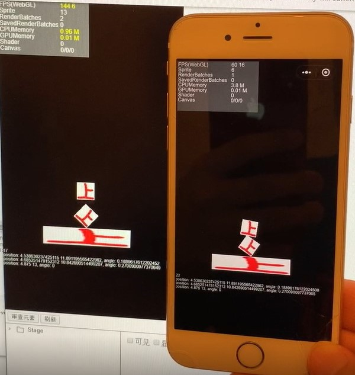

Box2d Deterministic Verify
=========

This project is for verifying whether Box2d in Laya game engine (ver 2.6.0) is deterministic.

Method
------

1. Initialize some dynamic boxes and step the world.
2. At step 30, record their positions and angles.
3. Reset these boxes and step the world from step 0 again. Goto step 2.

Conclusion
------

YES. It is deterministic.

But the angles are slightly different on Windows Chrome and iOS WeChat App.

<figure class="video_container">
  <iframe src="//player.bilibili.com/player.html?aid=925448843&bvid=BV1cT4y137mZ&cid=184512971&page=1" scrolling="no" border="0" frameborder="no" framespacing="0" allowfullscreen="true"> </iframe>
</figure>

